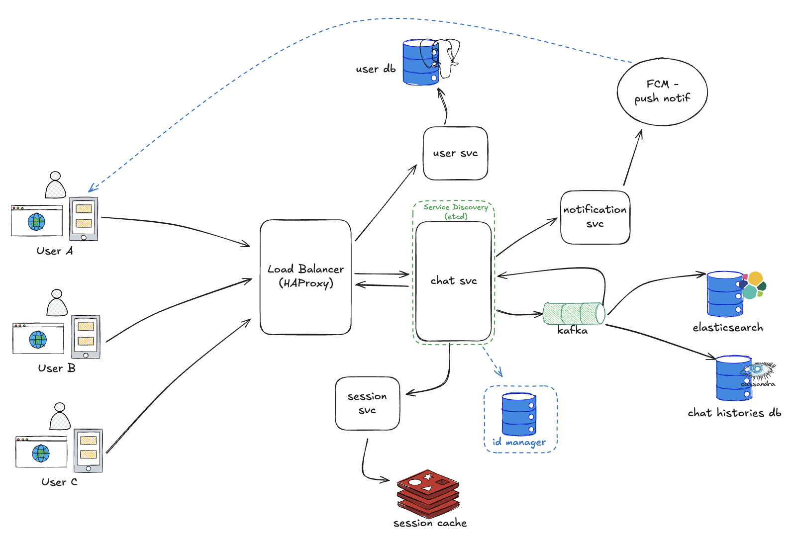
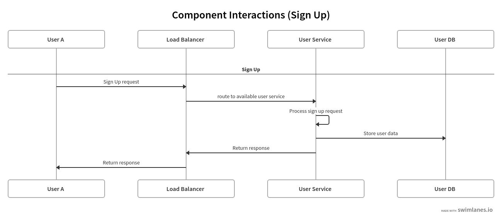
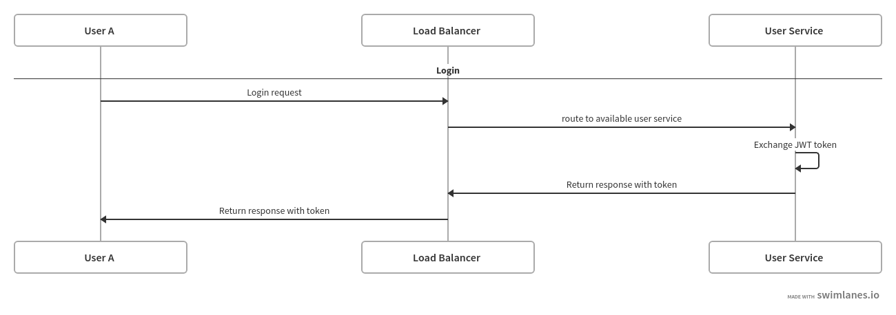
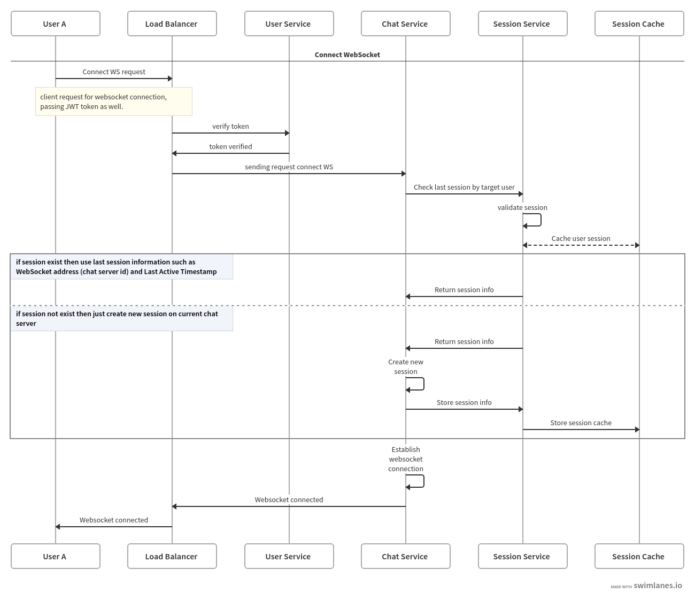
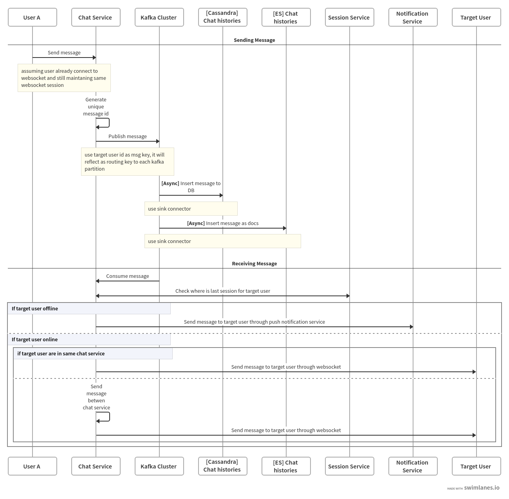
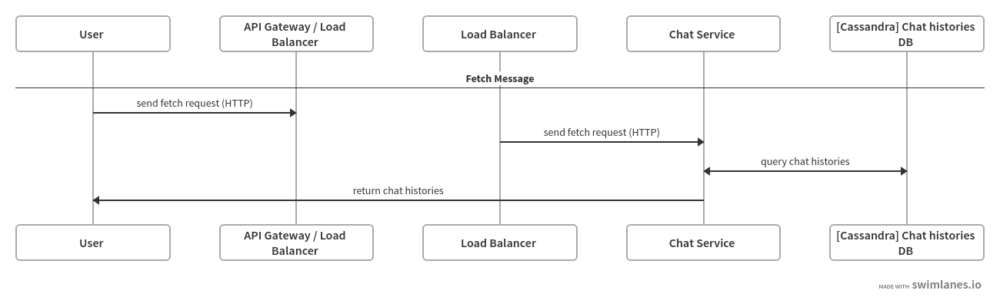
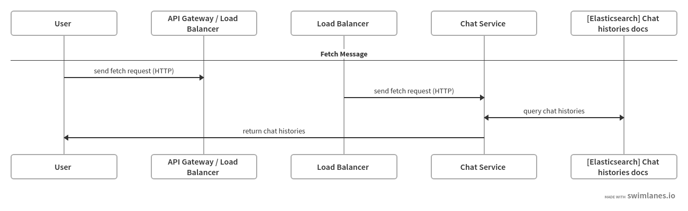

# Chat App Service

## Core Requirements

- Support 10,000+ concurrent users
- Implement end-to-end message encryption
- Enable real-time message delivery
- Provide message history and storage

## Constraints
- Chat service not support group or broadcast message
- Chat service not support to share media and files

## Assumptions
- Total User - Based on core requirement there are around 10k active user. assuming it's 70% of total user, So 10k = 70% -> 10k / 0.7 = 14.3k total users.
- Average messages per user per day: 50 (light chat)
- Average message size: 500 bytes (text only)
- Messages are **1 on 1 only** → no group chat
- Total messages per day = 14.3k x 50 = 715k
- Daily messages = 715k x 500 bytes = ~350 MB/day
- Monthly = ~10GB
- Yearly = ~120GB

## System Architecture
**High-level system design diagram**




Components :
- **User/Client**  
  The User is the entity representing an individual that interacts with the chat service. Serves as the actor that can send, receive, and manage messages or conversations. It could be as an mobile app, web server, or client SDK.


- **Load Balancer**  
  The load balancer distributes incoming client connections across chat servers for scalability and reliability. We use HAProxy because it supports websocket, handles failover with health checks, and could manages thousands of concurrent connections. We choose round robin for first initial route and use sticky session with cookies for next connection sequence.


- **User Service**  
  The User Service manages user related operations. It connects to the User Database and is responsible for registering new users, updating profile details, storing key for encryption, verifying credentials, tokens (JWT) and access resources.


- **User Database**  
  Databases to store information regarding users, profile, encryption key, etc.


- **Chat Service**  
  Act as an router and orchestrator between services, main responsibilities is to send and receive message between users, It will handles websocket connection then forward to session service, when connection and session establish it will forward messages through chat database. The chat service generates a globally unique and time ordered message ID using the Snowflake algorithm, ensuring both uniqueness across servers and chronological sequencing of messages.


- **Session Service**  
  This service will be source of truth for route between chat service, It will provide information when user want to exchange the messages between websocket, It also stores user session information such as online/offline status, and last seen information.


- **Session Cache**  
  This is redis storage for storing session information, It will dumped the data when user made websocket handshake, and it will saved as temporary data using TTL.


- **Kafka Message Broker**  
  Kafka used as message distributor from chat service into storage, We use kafka because we probably need to dump message into several databases option (prefer cassandra and elasticsearch), and kafka also works with partition event routing. The configuration will just have one topic with multiple consumer groups. Also used partition and user id as key so it will guarantee orders messages in partition.


- **Chat Histories Database**  
  This database will be act as an main database, It will be source of truth of histories chat, It only stores related to message payload, I choose Cassandra DB because it has good performance for high write throughput and it time series friendly, and Cassandra has quorum replication strategy.


- **Elasticsearch [nice to have]**  
  I choose and put elasticsearch because It will perform well when users want to advance search for the messages, It wont be the main source of truth for messages, It just copy and map message payload and message id and store as document in ES.


- **Notification Service**  
  It will function as notifier to client when chat service has incoming messages from users, If targeted user is offline then proceed to FCM.

**Component interactions**


- **Sign Up** - This process is mandatory for user, each user need to register their username before they can use chat app.


- **Login** - Process to verify user, only registered user can login. Main goals in here to authorize user by given credential (username and password), then in user service will check and exchange with JWT token.


- **Connect Websocket** - This process aim to made websocket connection between user and chat service, Ideally this occur when user open the app (could be running on background). I choose websocket because in chat app we want message deliver with real time features, There are many choices such like pooling, long pooling, or even grpc stream. The most proven transport layer for now is websocket because it provides low latency and persistent connection, It most importantly is can easily work with load balancers and clusters.


- **Send and Receive** - We will runthrough on how realtime message can be deliver from interactions above, Assume each user already made connection with chat server, and some user want to send message to target user. The messages will distributes into some storage for later as chat histories, and if target are available at that time it will forward the message to target user. I'm using kafka as message distributor, with some partition and routing key from event key


- **Fetch Message** - Last few messages could be fetches using common API via HTTP request, it queries directly into database to show histories of the chat


- **Search Message** - If user want to deep search by looking much pattern between messages, we could explore usage of elasticsearch, by storing chat histories into elasticsearch we add capability to do advance search or even we could do rune search by using es features

**Load balancing strategy**
Speaking of LB strategy, after I look up some feature provides by HAProxy I more tend into Sticky Session strategies with first initial connection (if user never connect to chat server) It's better to use Round Robin pattern, that pattern make sure our request are distributed fairly between the services (chat service). Implementing this will prevent uneven usage of chat service. After initial handshake we could combine with Sticky Session strategies, this strategies will route traffic based on previous session histories, It could be by the cookies or by source IP based, or even JWT token itself. This will ensure good websocket connection if user often to connect and disconnect. But this pattern has drawback as well, because it will always stick to previous session, there is potential issue when users that active is active in same server as well, it cause unbalance distribution and could potentialy make thundering herd on another services.

## Data Model
**Database schema**
- **User Table (PostgreSQL)**
```
CREATE TABLE users (
    user_id UUID PRIMARY KEY DEFAULT gen_random_uuid(),
    username VARCHAR(50) NOT NULL UNIQUE,
    email VARCHAR(100) UNIQUE,
    password_hash TEXT NOT NULL,
    public_key TEXT,      
    private_key TEXT,     
    created_at TIMESTAMPTZ NOT NULL DEFAULT now(),
    updated_at TIMESTAMPTZ NOT NULL DEFAULT now()
);
```

- **Session Cache (Redis)**
```
key:
session:user:<user_id>

value:
{
  "server_id": "chat-server-X",
  "ws_conn_id": "abc123",      
  "status": "online",          
  "last_seen": 1758824586,     
  "ttl": 3600                  
}
```

- **Event Schema (Kafka)**
```
key:
<conversation-id> (sender_id+receiver_id)

value:
{
  "message_id": "unique-id-from-snowflake",
  "conversation_id": "convAB",
  "sender_id": "userA",
  "receiver_id": "userB",
  "content": "Hello bang!",
  "created_at": 1758824586
}
```

- **Chat Histories (Cassandra)**
```
CREATE TABLE chat_histories (
    conversation_id text,
    message_id text,   
    sender_id text,
    receiver_id text,
    content text,
    created_at timestamp,
    PRIMARY KEY (conversation_id, message_id)
) WITH CLUSTERING ORDER BY (message_id ASC);
```

- **Chat Histories (Elasticsearch)**
```
PUT /chat_histories
{
  "mappings": {
    "properties": {
      "message_id": {
        "type": "keyword" 
      },
      "conversation_id": {
        "type": "keyword" 
      },
      "sender_id": {
        "type": "keyword" 
      },
      "receiver_id": {
        "type": "keyword" 
      },
      "content": {
        "type": "text",    
        "analyzer": "standard"
      },
      "created_at": {
        "type": "date"
      }
    }
  }
}
```

**Data partitioning approach**  
From my design only 3 components can be perform partitioning
- Postgresql (user) - Based on the assumptions above, there are approximately 14.3k total users. This is considered a small table, so partitioning is not required. It is sufficient to ensure that the columns are properly indexed, and note that the user table has a relatively low write load.


- Kafka (chat msg) - For Kafka, the partitioning strategy should use the `conversation_id` as the partition key. This ensures that all messages within the same conversation are stored in the same partition, preserving their chronological order. Multiple partitions can be created to allow horizontal scaling across chat service consumers. Each chat server can be part of the same consumer group, ensuring that each partition is consumed by only one server at a time while allowing parallel processing across partitions.
  **Assuming we have 4 chat services**, Each chat service could manage around 2.5k websocket connection: So we have minimum 4 partitions (1 consumer for 1 partition) It is least minimum, I will just multiply that for each consumer (4 x 4), With that I reccomend to use 16 partitions (min: 4, recommend: 16).


- Cassandra (chat msg histories) - In Cassandra, each conversation get own partition, use `conversation_id` as partition key. All messages in same conversation go inside that partition, sorted by `message_id` to keep time order. For 1 on 1 chat with around 14.3k users, maybe 10k active conversations at same time meaning around 10k partitions. If some conversation very big, can split by month. This way, partitions spread across nodes, read and write fast.

**Caching strategy**  
In my approach, I did not cache message for each user, I only use cached for session manager to save router information between websocket connection and chat services address, and If we stick with assumptions minimum 4 chat services, we don't need any partition or nodes addition for redis.

## Security
**End-to-end encryption implementation** - Chat app use asymmetric end to end encryption to make sure messages only can read by sender and receiver. Each user have public key and private key. Public key can share to anyone want send message, private key always stay secret on user device. When user send message, app encrypt message with receiver public key, only receiver can decrypt with own private key. Message always stay encrypted when go through chat server, Kafka, and database, server never can read content. This way, even server or storage hacked, messages still safe.

**Authentication and authorization** - The chat app uses JWT tokens for authentication and authorization. When a user logs in, the User Service verifies credentials and issues a JWT. The token is then presented to the Chat Service during WebSocket handshake to authenticate the user. The Chat Service trusts the User Service to validate the token and determine the users permissions, ensuring secure access to messages and resources without storing credentials on the chat servers.

**Security protocols** - Chat app use many security protocol to keep data safe. All communication use TLS/HTTPS or WSS (secure websocket) so no one can listen or change message. Chat messages also use encryption, only sender and receiver can read it. Private keys always encrypted, never send plain text. Access control use JWT token, only allow user to access own data. This way, messages safe and server safe.

## Scalability
**Handling concurrent connections** - Chat app use Kafka to handle messages async, so server can manage many users connect at same time without problem. When user send message, chat server forward message to Kafka topic, then return ack to sender fast. Kafka work as message broker, store message temporarily and distribute to multiple consumers. Chat server subscribe to Kafka to read message and forward to receiver if online. Meanwhile, storing messages to Cassandra happen async, so chat server not block and can handle more WebSocket connections. Load balancer (HAProxy) first use round robin for new connection to spread users, then use sticky session so user reconnect go same server. Redis session cache keep info which user connect to which server, so messages go correct WebSocket. This way, app can support 10k+ concurrent users, deliver messages in real time, and store history reliably.

**Message delivery patterns** - The chat app use direct real time messaging + pub/sub + store-and-forward pattern. When user send message, chat server publish message to Kafka. All chat servers subscribe Kafka, so message can go correct server. If receiver online, message send direct to WebSocket. If receiver offline, message still store in Cassandra and can trigger Notification Service to alert user. This way, message delivered fast, in order, and no lost even many users connect at same time.

## To Be Discuss
1. Better LB strategy
2. Group / Broadcast message
3. How to avoid thundering herd
4. More advance encryption
5. Encryption vs Searching

;